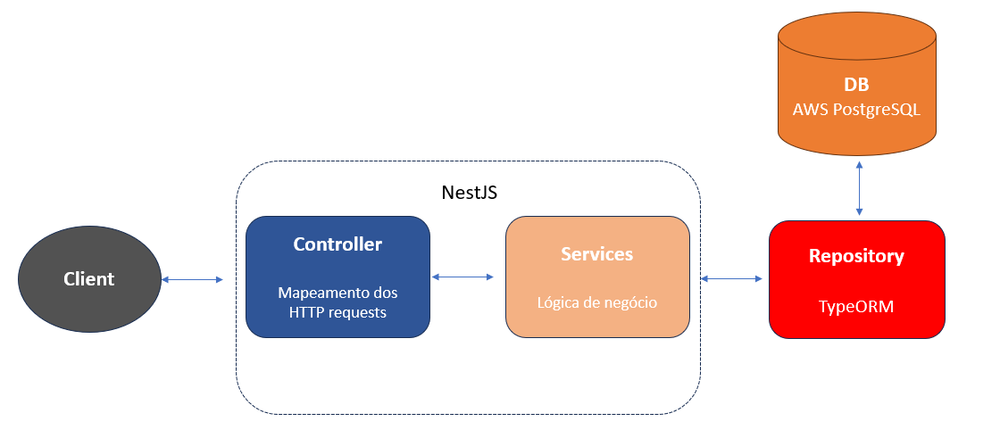

<h1 align="center">
API CONTA DIGITAL DEMO
</h1>

## Diagrama Entidade Relacionamento

<div style="display: flex; flex-direction: 'row'; align-items: 'center';">
   
</div>

## Modelo Entidade Relacionamento

<div style="display: flex; flex-direction: 'row'; align-items: 'center';">
   
</div>

## Scripts DDL e DML
Os scripts podem ser encontrados na pasta (scripts-SQL)[https://github.com/pcaixeto/api-conta-digital-demo/tree/main/scripts-SQL]

## API

### Arquitetura da API

<div style="display: flex; flex-direction: 'row'; align-items: 'center';">
   
</div>


## Como rodar a API
```bash
# Clone o repositorio:
$ git clone 

# Instale as dependencias
$ npm install

# Execute no Browser
$ npm run start

```
OBS: o postgres usado é privado, configure seu próprio DB em ormconfig.json e src/app.module.ts

# :rocket: Features

- Get/Create/update/delete tasks using GET, POST, PUT and DELETE Request Methods
- User authentication
- All testing is being made with Postman and Jest

## 💻 Technologies and libraries

<ul>
  <li>NodeJS</li>
  <li>NestJS</li>
  <li>Typescript</li>
  <li>Jest</li>
</ul>

### Deployed in Vercel

[Click Here to show](https://dog-list-demo.vercel.app/)

## :scroll: TO-DOS
   - (DONE)Create tests with Jest
   - User Authentication
   - Frontend Interface


**By: Pedro Caixeta**
