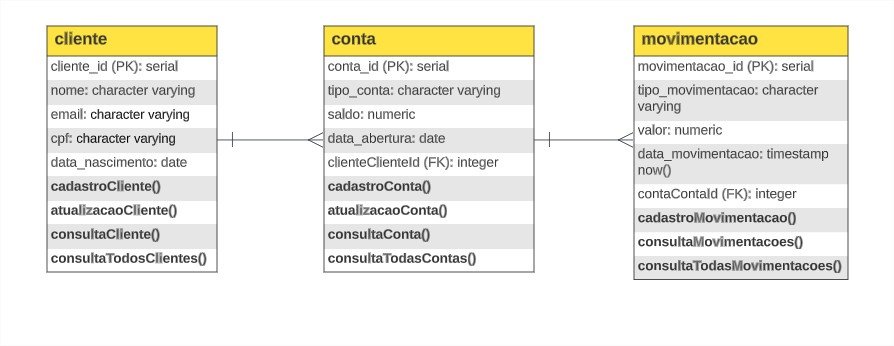
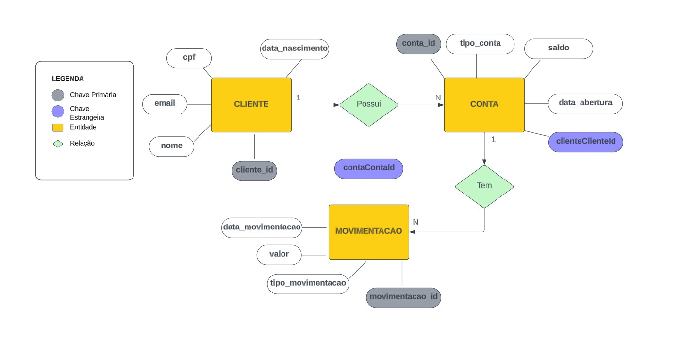

<h1 align="center">
# API CONTA DIGITAL DEMO
</h1>

## Screenshot

<div style="display: flex; flex-direction: 'row'; align-items: 'center';">
   
   
</div>

## 📥 How to run

```bash
# Clone the project:
$ git clone 

# Install the dependencies
$ npm install

# Run in browser
$ npm run dev

```

# :rocket: Features

- Get/Create/update/delete tasks using GET, POST, PUT and DELETE Request Methods
- User authentication
- All testing is being made with Postman and Jest

## 💻 Technologies and libraries

<ul>
  <li>NodeJS</li>
  <li>NestJS</li>
  <li>Typescript</li>
  <li>Jest</li>
</ul>

### Deployed in Vercel

[Click Here to show](https://dog-list-demo.vercel.app/)

## :scroll: TO-DOS
   - (DONE)Create tests with Jest
   - User Authentication
   - Frontend Interface


**By: Pedro Caixeta**
